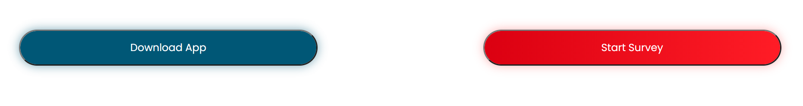

# Button
This button component is present in almost all the public home pages, is used to redirect the user to other pages in the 

* home
* be-part
* life-project

These are the following accepted props:

Name  | Type | Description
  ------------- | ------------ | -------------
color  | `string` | This is the color which the component will take, the current colors supported are: `-red` and `-blue`, if you want to support more colors, you have to add it in the [styles.css](./styles.scss)
text   | `string` | Is the text which will be shown in the button.
to     | `string` | The path to which the button will redirect to.

[GO BACK](../README.md)