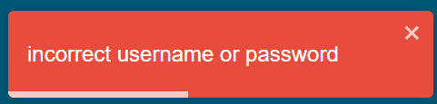

# ErrorMessageToast

This Component is an Error Toast that will appear each time there is an error it will appear explaining the error, or the steps to take.

Additionally, the react-toast package is used for the toast message.

There are the available props for this component

Name  | Type | Description
  ------------- | ----------------------------------- | -------------
position        | `top-left top-right top-center`       | The position where the toast will appear, you can check the npm toast package to add more options to this param.
closeOnClick    | `boolean`                           | Enables or Disables the close button in the toast.
draggable       | `boolean`                           | Enables or Disables the option of a draggable toast.
hideProgressBar | `boolean`                           | Shows or hides the progress bar of the toast.
message         | `string`                            | The message that will appear in the toast.
pauseOnHover    | `boolean`                           | Enables or Disables the option on pause the timer to keep reading the toast.
autoClose       | `number`                            | Enables or Disables the auto close option of the toast.
setToggleToast  | `(toggleToast:boolean) => void`     | Its a function to set to false the toggleToast variable that should be in the state of the parent component.
toggleToast     | `boolean`                           | If true, it will toggle the toast.
setError        | `(params:setErrorFunction) => void` | used to set the error variable to false after the toast is triggered.

## Check the source code clicking [here](./index.tsx)
## For checking the props types click [here](./interface.ts)

[GO BACK](../README.md)