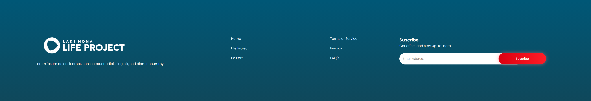

# Footer

This is the footer component of the footer, this will only show on the pages that are in the menu of the home. the rest 
will hide the footer with a global context variable.

## This component has no props.

### Check the source code clicking [here](./index.tsx)
### For checking the styles click [here](./styles.scss)
### For checking the constants click [here](./constants.js)

[GO BACK](../README.md)