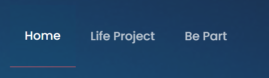

# Navbar

The navbar of the public part of the application. 

Name  | Type | Description
  ------------- | -------------- | -------------
theme            | `string`       |  the theme of the navbar, the available values are: `light` `dark`

### Check the source code clicking [here](./PublicNavBar/index.tsx)
### For checking the styles click [here](./PublicNavBar/styles.scss)

# Navbar Element

The navbar element, this is each of the squares of the navbar, it is used inside the `Public navbar component`

Name  | Type | Description
  ------------- | -------------- | -------------
name            | `string`       |  The element text Ex: `Home`
route            | `string`      |  The route to it will redirect

### Check the source code clicking [here](./NavBarElement/index.tsx)
### For checking the styles click [here](./NavBarElement/styles.scss)

[GO BACK](../README.md)