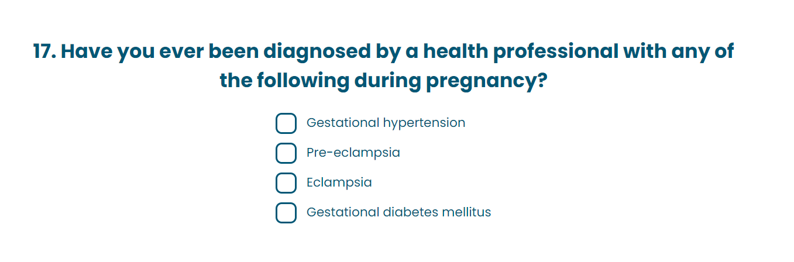
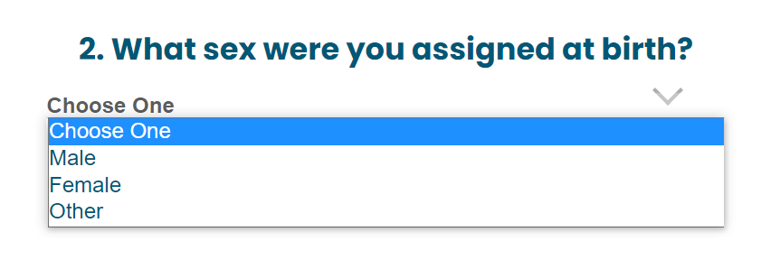
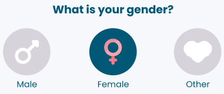
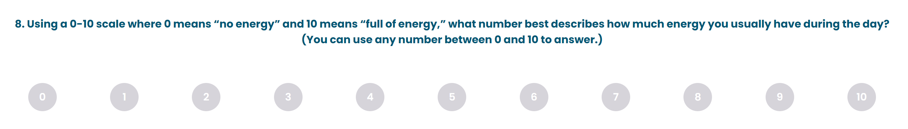
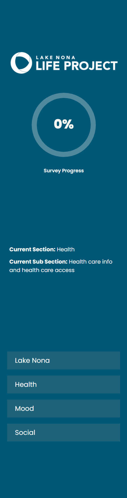
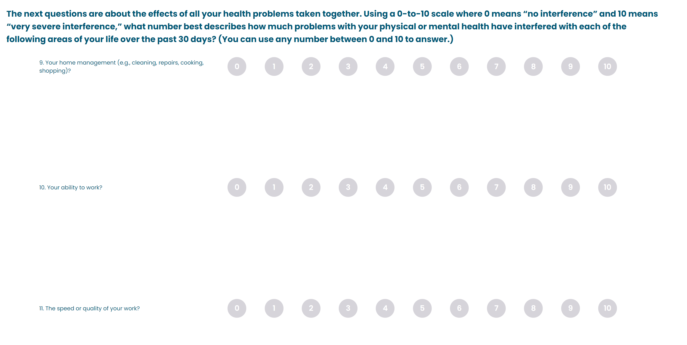
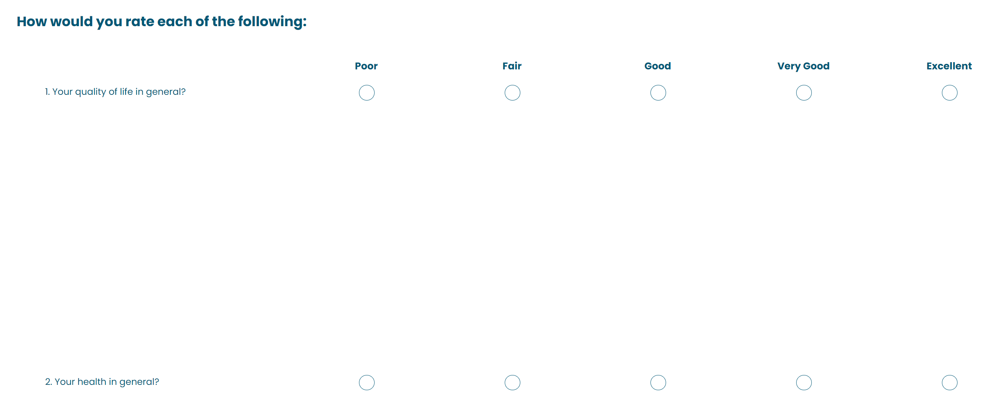
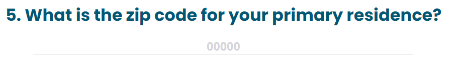
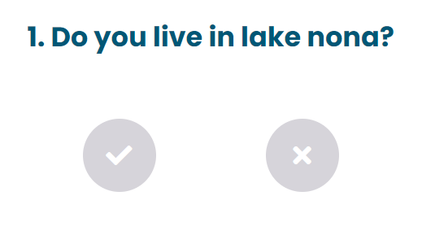

# Survey Components
Here are the survey components that are reused various times depending on the question category.

The list of available components are:

* ## CheckBoxQuestion

The checkbox question is a multiple choice with multiple selection as an answer, the result will be saved as a csv into de database

the possible props are: 

Name  | Type | Description
  -------------  | ---------        | -------------
question  | `string` | Is the question that will be displayed in the component.
items       | `Items` | Is an array of items to be mapped in the questions to be selected
questionId       | `string` | Is the question database id
setResponse | `(string,string,number,string) => void` | set response function that takes 4 parameters and returns null, is meant to be used in the survey container.
order    | `number` | the order of the question 
inputConfirmation    | `string` | Is the string that tells what kind of validation needs to be applied to the inputs.

To see the code [click here](./CheckBoxQuestion/index.tsx)

To see the styles [click here](./CheckBoxQuestion/styles.scss)

* ## ComboBoxQuestion

The combo box questions is a combo that contains choice, and the user can just choose one option, the response is saved in a string.

the available props are:

Name  | Type | Description
  -------------  | ---------        | -------------
question  | `string` | Is the question that will be displayed in the component.
items       | `Items` | Is an array of items to be mapped in the questions to be selected
questionId       | `string` | Is the question database id
setResponse | `(string,string,number,string) => void` | set response function that takes 4 parameters and returns null, is meant to be used in the survey container.
order    | `number` | the order of the question
inputConfirmation    | `string` | Is the string that tells what kind of validation needs to be applied to the inputs.

To see the code [click here](./ComboBoxQuestion/index.tsx)

To see the styles [click here](./ComboBoxQuestion/styles.scss)

* ## ImageQuestion

The image question is a multiple choice questions with unique question that will show some kind of images in it. 

the available props are:

Name  | Type | Description
  -------------  | ---------        | -------------
question  | `string` | Is the question that will be displayed in the component.
items       | `Items` | Is an array of items to be mapped in the questions to be selected
questionId       | `string` | Is the question database id
setResponse | `(string,string,number,string) => void` | set response function that takes 4 parameters and returns null, is meant to be used in the survey container.
order    | `number` | the order of the question
inputConfirmation    | `string` | Is the string that tells what kind of validation needs to be applied to the inputs.
radioGroup    | `string` | it is the group that the radio buttons will be part of.
checked    | `string` | It marks back the option checked when the user selected before.
setLoading    | `string` | a functions that sets a loading marker *(DEPRECATED)*
imagesPath    | `string[]` | An array of paths to get the images from

To see the code [click here](./ImageQuestion/index.tsx)

To see the styles [click here](./ImageQuestion/styles.scss)

* ## LadderQuestion

The ladder questions is a radio group with inputs that are just numbers in a consecutive way.

the available props are:

Name  | Type | Description
  -------------  | ---------        | -------------
questionText  | `string` | Is the question that will be displayed in the component.
values       | `Items` | Is an array of items to be mapped in the questions to be selected
questionId       | `string` | Is the question database id
setResponse | `(string,string,number,string) => void` | set response function that takes 4 parameters and returns null, is meant to be used in the survey container.
order    | `number` | the order of the question
inputConfirmation    | `string` | Is the string that tells what kind of validation needs to be applied to the inputs.
radioGroup    | `string` | it is the group that the radio buttons will be part of.
checked    | `string` | It marks back the option checked when the user selected before.

To see the code [click here](./LadderQuestion/index.tsx)

To see the styles [click here](./LadderQuestion/styles.scss)

* ## LeftBar

the leftbar is the menu at the left of the application, this left bar uses a hook to fetch the sections and subsections and then render them at the menu.

it doesn't have props

To see the code [click here](./LeftBar/src/index.tsx)

To see the styles [click here](./LeftBar/src/styles.scss)

* ## MultiLadder

the multiladder is same as a ladder question, but it will render more than one question in a table

the available props are:

Name  | Type | Description
  -------------  | ---------        | -------------
question  | `string` | Is the question that will be displayed in the component.
items       | `Items` | Is an array of items to be mapped in the questions to be selected
questionId       | `string` | Is the question database id
setResponse | `(string,string,number,string) => void` | set response function that takes 4 parameters and returns null, is meant to be used in the survey container.
order    | `number` | the order of the question
inputConfirmation    | `string` | Is the string that tells what kind of validation needs to be applied to the inputs.
radioGroup    | `string` | it is the group that the radio buttons will be part of.
stackPhrase    | `string` | Is the phrase that gives context to the question.

To see the code [click here](./MultiLadder/index.tsx)

To see the styles [click here](./MultiLadder/styles.scss)

* ## RadioButtonGroup

This are radio button simple questions that are mostly displayed by groups.

the available props are:

Name  | Type | Description
  -------------  | ---------        | -------------
question  | `string` | Is the question that will be displayed in the component.
items       | `Items` | Is an array of items to be mapped in the questions to be selected
questionId       | `string` | Is the question database id
setResponse | `(string,string,number,string) => void` | set response function that takes 4 parameters and returns null, is meant to be used in the survey container.
order    | `number` | the order of the question
inputConfirmation    | `string` | Is the string that tells what kind of validation needs to be applied to the inputs.
radioGroup    | `string` | it is the group that the radio buttons will be part of.
stackPhrase    | `string` | Is the phrase that gives context to the question.

To see the code [click here](./RadioButtonGroup/index.tsx)

To see the styles [click here](./RadioButtonGroup/styles.scss)

* ## TextInputQuestion

the text input component is an open question to answer.

the available props are:

Name  | Type | Description
  -------------  | ---------        | -------------
question  | `string` | Is the question that will be displayed in the component.
questionId       | `string` | Is the question database id
setResponse | `(string,string,number,string) => void` | set response function that takes 4 parameters and returns null, is meant to be used in the survey container.
order    | `number` | the order of the question
inputConfirmation    | `string` | Is the string that tells what kind of validation needs to be applied to the inputs.
placeholder    | `string` | This is the placeholder for the text input

To see the code [click here](./TextInputQuestion/index.tsx)

To see the styles [click here](./TextInputQuestion/styles.scss)

* ## YesNoQuestion

The yes no questions is a simple question that only has a yes or no as a response

the available props are:

Name  | Type | Description
  -------------  | ---------        | -------------
question  | `string` | Is the question that will be displayed in the component.
questionId       | `string` | Is the question database id
setResponse | `(string,string,number,string) => void` | set response function that takes 4 parameters and returns null, is meant to be used in the survey container.
order    | `number` | the order of the question
inputConfirmation    | `string` | Is the string that tells what kind of validation needs to be applied to the inputs.
radioGroup    | `string` | Its the group of the radio button.

To see the code [click here](./YesNoQuestion/index.tsx)

To see the styles [click here](./YesNoQuestion/styles.scss)

[GO BACK](../README.md)